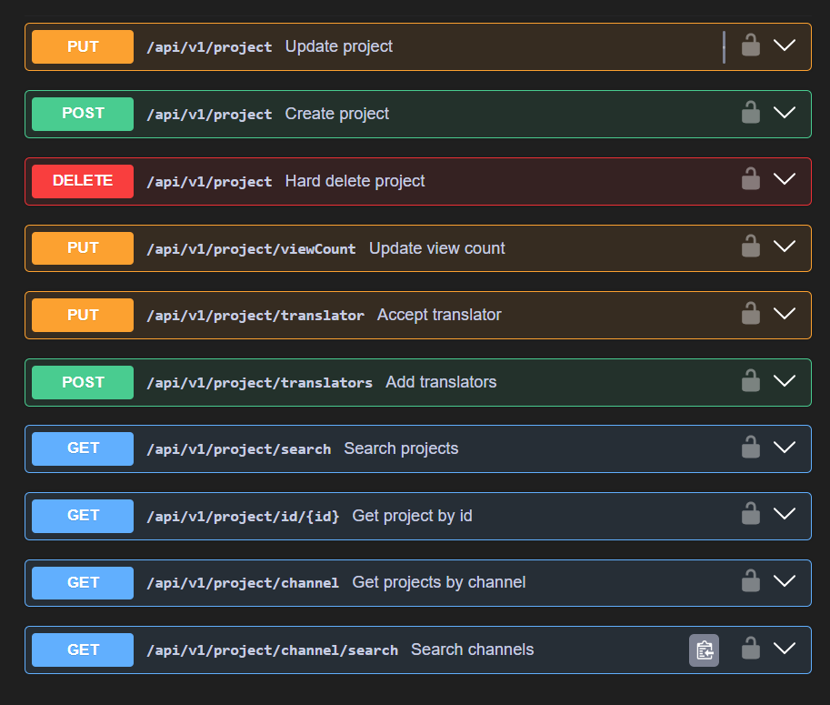
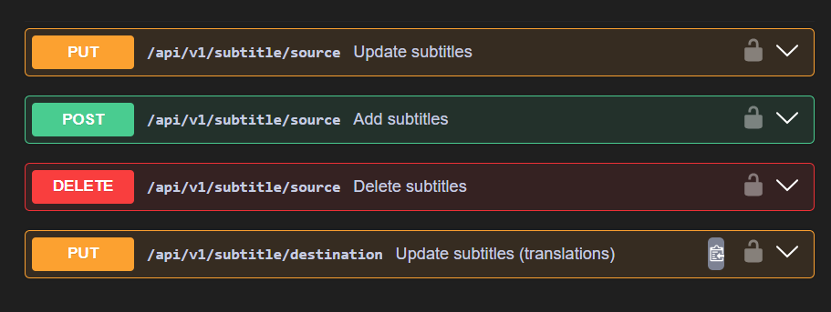
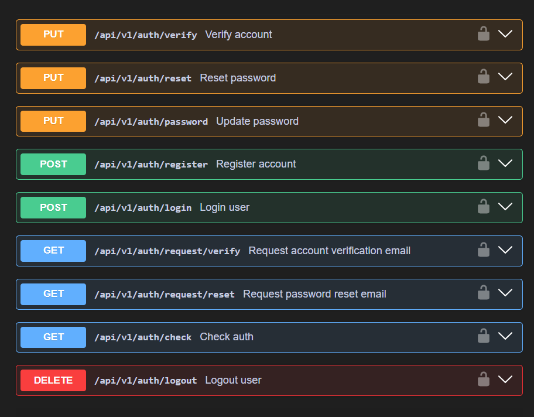
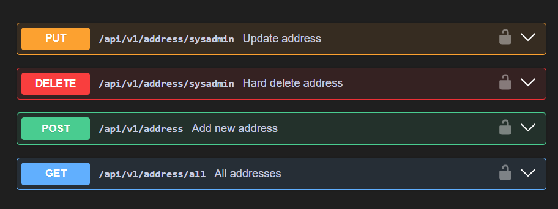
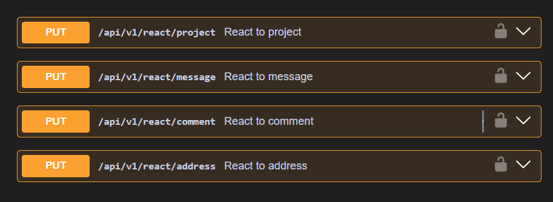
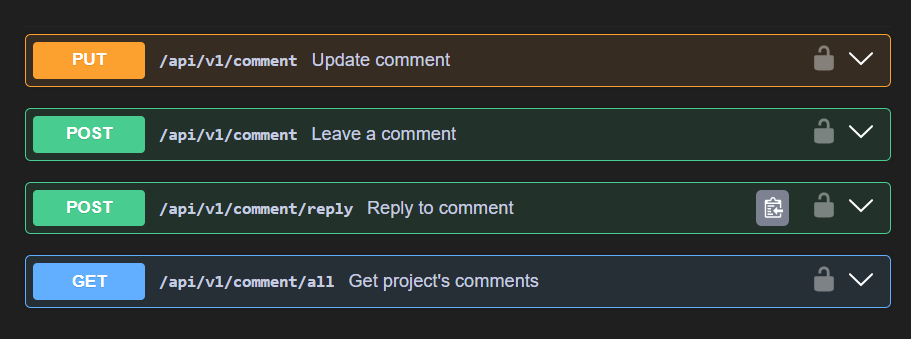
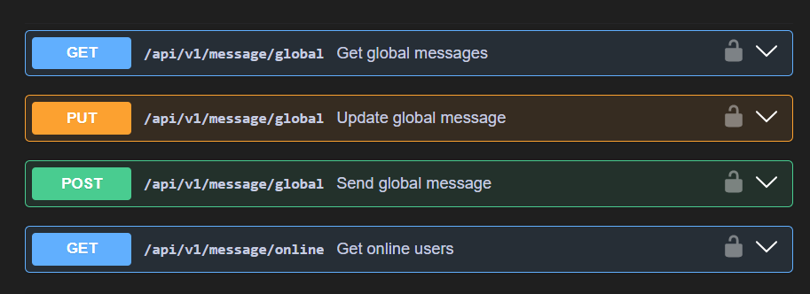
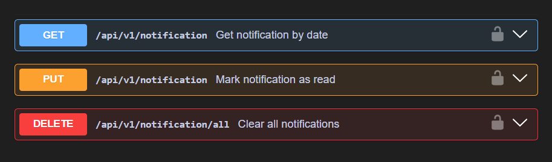

# 🌍 Miracle4You (M4Y)

**Miracle4You (M4Y)** is a platform built to make it easier for language learners to collaborate on creating multilingual subtitles for educational videos. By contributing subtitles, learners can improve their language skills while doing something meaningful for the community.

This is my personal dream project—not overly complex or fancy, but I truly hope it brings real positive impact.

---

## 🚀 Features

### 📽️ Project & Subtitle



- Videos are sourced from **YouTube**
- Video metadata and **source subtitles** (original language) can be scraped from YouTube — this process is handled on the frontend (Next.js) to simplify backend responsibilities
- Each **Project** represents a unique pairing of:
  - **Video**
  - **Language**

> For example:
>
> - Video A – Vietnamese
> - Video A – French  
>   → These are two separate projects.

- Each project has an **Admin** (the creator), who can:
  - Approve translator requests
  - Add other users as translators to the project
- Real-time collaborative subtitle editing is **coming soon**
- Flexible project search capabilities:
  - By **keywords** _(optional)_
  - By **language** _(optional)_
  - Sorted by **relevance**, **view count**, or **creation time**

> Powered by PostgreSQL **Full-Text Search**

---

### ✍️ Subtitle System



- **Source subtitles** (original language) are managed by the **first user** who submits them to the project
- **Translated subtitles** can be updated by:
  - The **Project Admin**
  - Approved **Translators**
- Subtitles are stored in the database as a **JSONB** column in PostgreSQL, with this structure:

```json
{
  "videoUrl": "https://youtube.com/...",
  "srcText": {
    "text": "Hello, world!",
    "langCode": "en",
    "translator": "admin1"
  },
  "desTexts": [
    { "text": "Xin chào, thế giới!", "langCode": "vi", "translator": "admin1" },
    { "text": "Bonjour, le monde!", "langCode": "fr", "translator": "admin2" }
  ]
}
```

### 🔐 Authentication



- Register with email or login via **Google**
- Email verification and password reset supported
- Simple text-based emails

### 👤 User


- Update profile and avatar
- Make translator request (Become translator of a project)
- Follow and unfollow users

### 📍 Address System



- Smaller address entities: **Diocese**, **Deanery**, **Parish**
- Users can propose new addresses for admin approval
- Community can react to proposed addresses

### 😊 Reactions



- Emoji reactions (laugh, happy, sad, frustrated, love, etc.)
- React to:
  - Projects
  - Comments & replies
  - Messages
  - Addresses

### 💬 Comments



- Nested commenting (max 2 levels)
- Support for emoji reactions

### 🗨️ Global Chat



- Real-time messaging with WebSocket
- Edit messages shortly after sending
- React to chat messages
- View online users

### 🔔 Notifications



- **Instant** and persistent event notifications
- Users are notified about key events such as translator request updates, birthday greetings, .etc

---

## 🧰 Tech Stack

| Layer         | Technology                         |
| ------------- | ---------------------------------- |
| **Backend**   | Java, Spring Boot                  |
| **Database**  | PostgreSQL, Hibernate ORM, Flyway  |
| **Caching**   | Hibernate L2 Cache, Spring Cache   |
| **Security**  | Spring Security, JWT, Google Login |
| **Real-time** | WebSocket                          |
| **Email**     | JavaMail (Gmail SMTP)              |
| **API Docs**  | Swagger                            |

---

## 🛠️ Upcoming Features

- 🔄 Real-time subtitle editing for teams
- 🚩 Reporting system (bad comments, translations, etc.)
- Ongoing bug fixes
- Frontend web application development

---

## 🤗 Thanks for Visiting!

Thank you for taking the time to explore **Miracle4You (M4Y)**.  
Whether you're here to contribute, give feedback, or just curious—your interest means a lot.

Have a wonderful day and enjoy coding!
